# R20PLUS - A QA Web App Python Project

R20+ is a simple web-app where you can host all your character sheets from Dungeons & Dragons 5E. You can create, roll or edit your character without the need of pen and paper. This app was created in Python 3, Flask, Flask-Bootstrap, Selenium, Gunicorn, GCP SQL Instances & many others. The program is hosted on Google Cloud Platform & automated in Jenkins.

The Purpose of this project was to create a CRUD application (Create, Read, Update, Delete) with utilisation of supporting tools, methodologies and technologies that that encapsulate all core modules covered during training. Tools and methodologies include. 

* Kanban Board: Trello or an equivalent Kanban Board
* Database: GCP SQL Server or other Cloud Hosted managed Database.
* Programming language: Python
* Unit Testing with Python (Pytest)
* Integration Testing with Python (Selenium)
* Front-end: Flask (HTML) Flask-Bootstrap used
* Version Control: Git
* CI Server: Jenkins
* Cloud server: GCP Compute Engine

### Visit the site
#### [Click this link](http://35.246.21.165:5000/) Please Follow README 

# Table of Contents
## Navigate across Content
- [Tutorial](#Tutorial)
- [Database](#Database)
- [Testing](#Testing)
- [Risk-Assessment](#Risk-Assessment)
- [Trello](#Trello)
- [Developer-notes](#Developer-notes)

# Tutorial
### Turorial documented as first time user.

#### Step 1) Navigate to Homepage. 
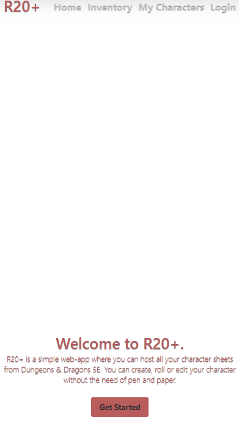

#### Step 2) Click get started or login to navigate to login page. 
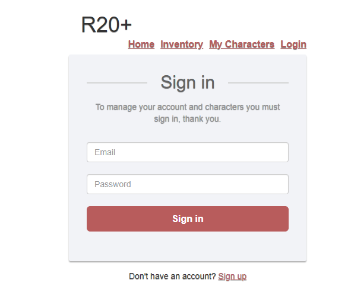

#### Step 3) Click sign up to navigate to register page. 
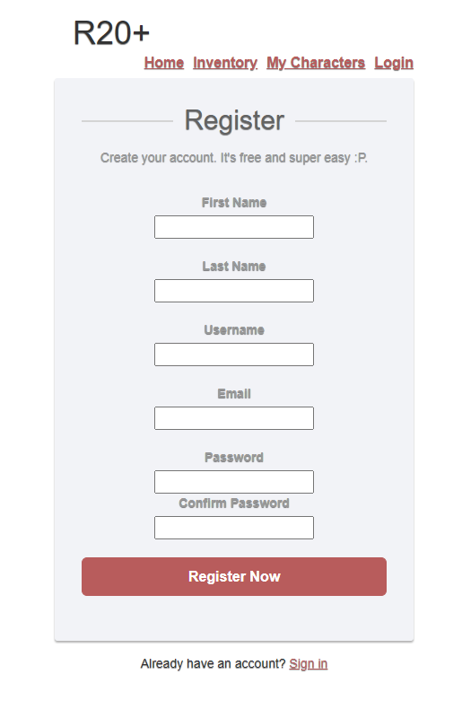

#### Step 4) Once signed up you will be automatically navigated to character page, click create new character to create a new character. 

#### Step 5) Fill in the forms and create your character.
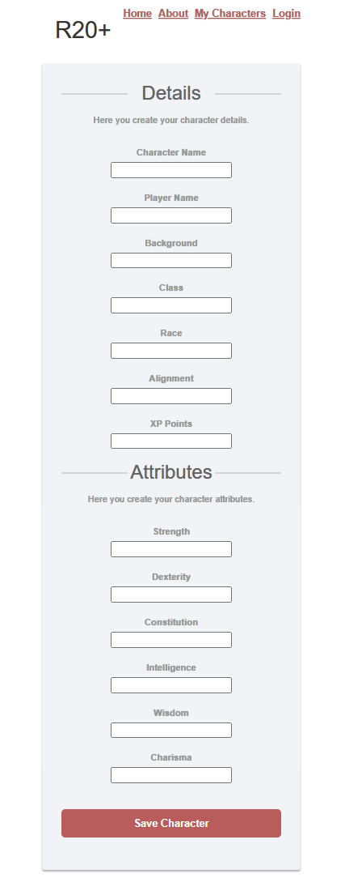

#### Step 6) Once you have created your character you will be automatically redirected to the My Characters page where your character will show.
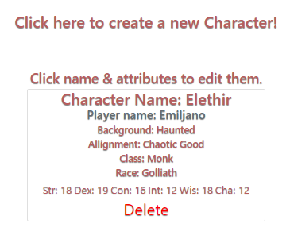

#### Step 7) To edit your character, click the players name or any one of the attributes and you will be directed to the edit page.
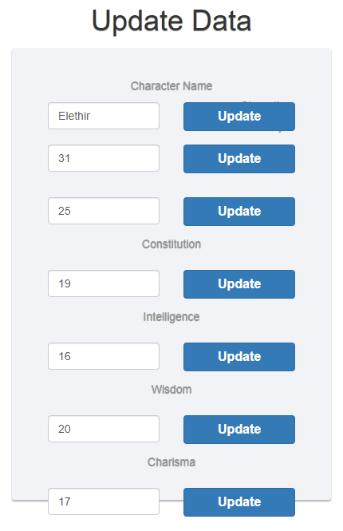

#### Step 9) Once your character is edited you will be redirected back to the 'my characters' page where you will see your character updated
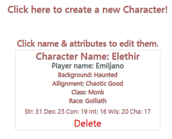

#### Step 10) Ok now you have a Character! But characters need an inventory, to do this navigate to inventory page from the navigation bar and you can see the inventory page like so.
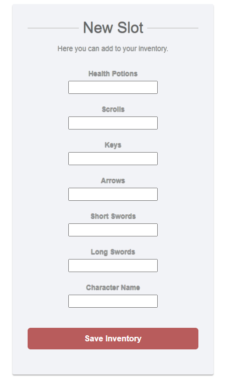

#### Step 11) Once you have added an inventory set you will be automatically redirected to the inventory page where your set will show.

#### Step 12) To edit your inventory set, click any one of the items and you will be directed to the edit page much like the character edit.

# Database
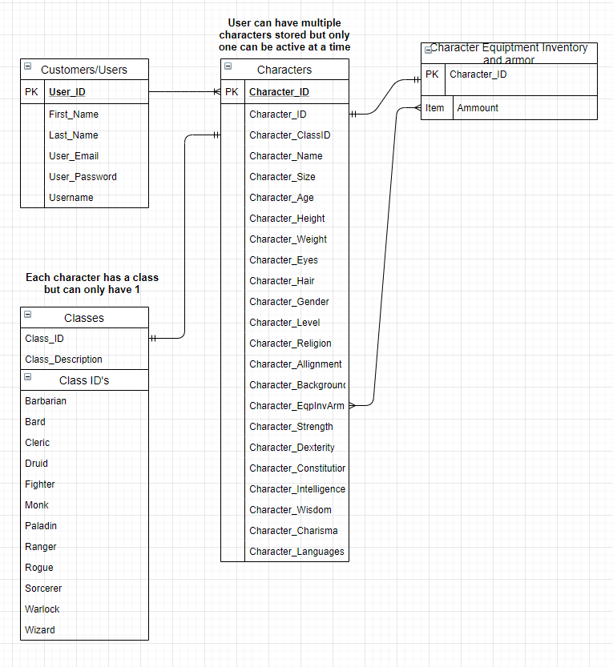

In terms of Entity Relationship Diagram I decided to follow  the structure of the roleplaying game. Each player can have multiple characters meaning there is a one to many relationship between users and characters tables. Each character can only have 1 Inventory slot meaning it is a One to One relationship between characters and inventory tables.

# Testing

. I made sure each feature was assigned to the correct principle. 

## Sprint 1
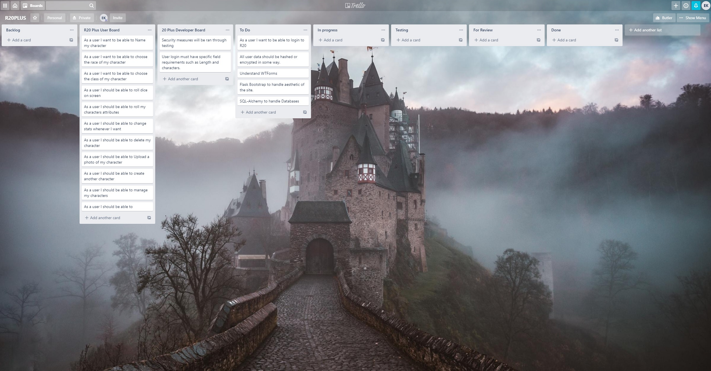

## Sprint 2
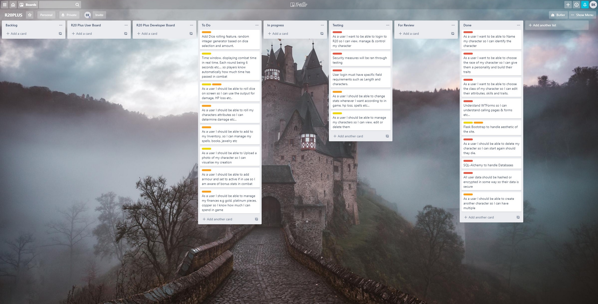

## Sprint 3
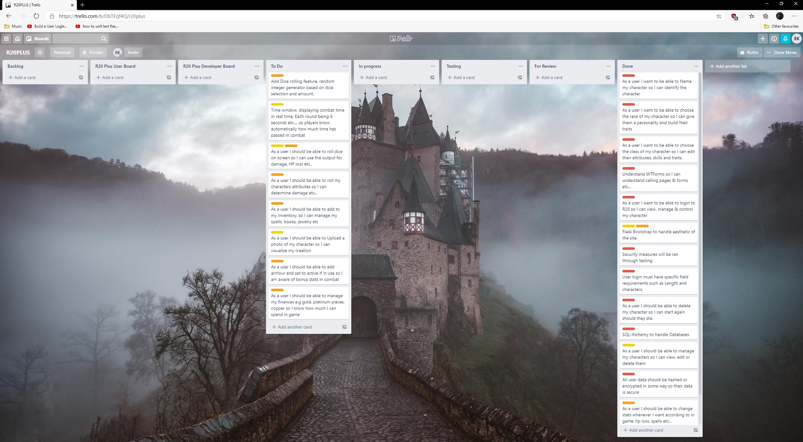

# Developer-notes
## In this section I will discuss what I would've wanted to include into the program or further processes I should have taken. 

### Dice rolling
It would have been nice to include a random dice roller so the user doesnt have to manually put in the attributes. This wouldve added to automation but with the time constraints that this project had it would have proven very difficult.

### Time window
Simple custom timers users can set to help them with their gameplay and campaign.

### Finances
Manage user finances much like attributes. Diamonds, Gold, Silver, Copper.

### Further Back End Testing
Further back end testing is required, there are still some features that have not been tested.

### Further Front End Testing
Further testing using Xpaths is required in this project. 
