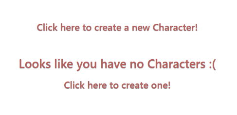
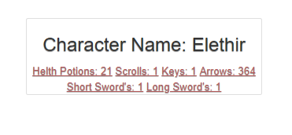

# R20PLUS
## An Intuitive online character sheet for Dungeons & Dragons 5th Edition!

### R20+ is a simple web-app where you can host all your character sheets from Dungeons & Dragons 5E. You can create, roll or edit your character without the need of pen and paper. This app was created in python 3, Flask, Flask-Bootstrap & many others. The program is hosted on Google Cloud Platform & automated in Jenkins.

### Visit the site
#### Jenkins Host: 35.246.21.165:5000

# Table of Contents
## Navigate across Content
- [Tutorial](#Tutorial)
- [Risk-Assessment](#Risk-Assessment)
- [Trello](#Trello)
- [Developer-notes](#Developer-notes)

# Tutorial
### Turorial documented as first time user.
#### Step 1) Navigate to Homepage. 

#### Step 2) Click get started or login to navigate to login page. 

#### Step 3) Click sign up to navigate to register page. 

#### Step 4) Once signed up you will be automatically navigated to character page, click create new character to create a new character. 

#### Step 5) Fill in the forms and create your character.

#### Step 6) Once you have created your character you will be automatically redirected to the My Characters page where your character will show.

#### Step 7) To edit your character, click the players name or any one of the attributes and you will be directed to the edit page.

#### Step 9) Once your character is edited you will be redirected back to the 'my characters' page where you will see your character updated

#### Step 10) Ok now you have a Character! But characters need an inventory, to do this navigate to inventory page from the navigation bar and you can see the inventory page like so.

#### Step 11) Once you have added an inventory set you will be automatically redirected to the inventory page where your set will show.

#### Step 12) To edit your inventory set, click any one of the items and you will be directed to the edit page much like the character edit.

# Risk-Assessment

# Trello
## Sprint 1

## Sprint 2

## Sprint 3

# Developer-notes
## In this section I will discuss what I would've wanted to include into the program or further processes I should have taken. 

### Dice rolling
It would have been nice to include a random dice roller so the user doesnt have to manually put in the attributes. This wouldve added to automation but with the time constraints that this project had it would have proven very difficult.
### Time window
Simple custom timers users can set to help them with their gameplay and campaign.
### Finances
Manage user finances much like attributes. Diamonds, Gold, Silver, Copper.
